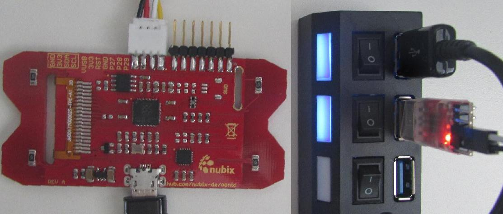

# Requirements

- `arm-none-eabi-gcc`: [ARM GCC
  cross-compiler](https://developer.arm.com/downloads/-/arm-gnu-toolchain-downloads)[^compiler]
- Git version control system
- CMake meta build system

[^compiler]: user may want to install it from source, if the one from the
    repository does not work

For the examples the assumption is that the user is using a Ubuntu machine, but
he/she may run on Windows or MacOS without a problem.

```sh
sudo apt update -y --fix-missing
sudo apt install -y git cmake gcc-arm-none-eabi
```

## Optional

- Doxygen automatic code documentation generator
  - Graphviz automatic dot diagrams drawing, used by Doxygen for creating
    include dependencies diagrams
  - PlantUML automatic diagrams drawing, used by Doxygen for creating some
    diagrams
- Clang Format automatic code formatter[^formatter]

[^formatter]: will be required for some projects, if the user wants to
    contribute with Pull-Requests

```sh
sudo apt install -y doxygen graphviz clang-format plantuml
```

# Manually compiling the program

After installing `git` and `cmake`, on Linux:

```sh
# in project root for the snake project
mkdir build
cmake -D CMAKE_BUILD_TYPE=Debug -S .. -B build
cmake --build build --target snake
```

# Programming with a coin (BOOTSEL)

BOOTSEL (boot selector) as the name implies, gives you two alternatives:

1. just boot the device with whatever is currently in flash
2. make the flash available to the programming end (ie. computer) as an
   USB-stick

With the last option, you may program the device without any external special
device and without having to solder to the board.

When you compile and install a new binary, a `.uf2` binary is generated under
the `deploy/` folder. If you copy this file inside the pico, it will then be
programmed. The disadvantage of this method is that you have to disconnect the
OPNIC board and plug it back again with the BOOTSEL selected every time you want
to program the device.

Workflow is:

1. stick a coin in the BOOTSEL spot, we recommend a 2¢ euro coin
2. plug the OPNIC board to the computer
3. remove the coin
4. run `./build.sh <PROJECT> [clean] build uf2`

# Programming with Picoprobe

For more information, please consult the [getting started with
pico](https://datasheets.raspberrypi.com/pico/getting-started-with-pico.pdf).

This is the recommended way to program the OPNIC board. But you will have to but
and solder the [SM03B-SRSS-TB](https://www.jst-mfg.com/product/pdf/eng/eSH.pdf)
header (female) connector to the back of the board board (SWD, J1). Moreover,
you need to get the [SHR-03V-S](https://www.jst-mfg.com/product/pdf/eng/eSH.pdf)
matching housing (male) connector. For the edge connector, you can just solder a
common pin header. Another solution for both is to directly solder the pins with
the help of wires.

picoprobe|OPNIC pin|obervation
-|-|-
GND|GND|Bind OPNIC common ground to the SWD connector ground
GPIO-2|SWDCLK|Pin available on the back, J1 connector
GPIO-3|SWDIO|Pin available on the back, J1 connector
VSYS|3V3|Pin available on the boards edge
GPIO-4|SCL|Same as OPNIC UART1-Rx
GPIO-5|SDA|Same as OPNIC UART1-Tx

Additionally, you have to get  the [OpenOCD with support for the RP2040
microcontroller](https://github.com/raspberrypi/openocd.git):

```sh
git clone https://github.com/raspberrypi/openocd.git \
    --branch rp2040 --depth=1 --no-single-branch
cd openocd
./bootstrap
./configure --enable-picoprobe
make -j 4 && make install
```

Please note that you have to install `utils/99-pico.rules` udev rules before
running the script.

# Debug in VSCode

Install the following extensions:

- [Cortex-Debug](https://marketplace.visualstudio.com/items?itemName=marus25.cortex-debug)
- [CMake
  Tools](https://marketplace.visualstudio.com/items?itemName=ms-vscode.cmake-tools)
- [C/C++](https://marketplace.visualstudio.com/items?itemName=ms-vscode.cpptools)

```sh
code --install-extension marus25.cortex-debug
code --install-extension ms-vscode.cmake-tools
code --install-extension ms-vscode.cpptools
```

Then

1. "Click to change the active configure preset" on the lower bar
2. Click on the CMake extension tab icon
3. "Configure All Projects"
4. "Build All Projects" or build the specific project that you want
5. "Run and Debug (Ctrl+Shift+D)" on the side menu
6. Select "Run / Debug (F5)" Icon
7. "Start Debugging"

Please note that "Cortex Peripherals" section will only be available if you let
the build download a fresh pico-sdk. "Cortex Peripherals" needs the `.svd` file
to parse the registers into their correct namings.

# Hardware

- Microcontroller: RP2040
  - SRAM: 264kiB on-chip SRAM
  - no built-in flash
- External flash memory: IS25LP040E, 512kiB

The screen is a LT177ML37 1.77 inch 128*RGB*160 TFT LCD Display with integrated
GC9106 used. The used code however is for the LT177ML35, which is compatible.
Although the GC9106 can use I²C, SPI interfaces, the LT177ML37 forces one to use
the parallel interface. GC9106 and touch pads drivers uses the Programmable
Input/Output (PIO) from RP2040 microcontroller.

The pico-sdk lets us create a board description file, which the contents are
available globally in the project. The board description file is a C header that
describes the board and it is located at `firmware/board/nubix-opnic.h`.

# Serial communication

There are two serial implementations: USB CDC and UART.
For the UART you may use a picoprobe with the connections described in the
[programming with picoprobe](#programming-with-picoprobe), or a USB bridge
adapter. For the USB CDC, a device will automatically appear.

The `serial` function in the `build.sh` will automatically detect a method and
try to connect to it, if the project has it enabled.

Note that you may use the C `printf` or the `C++` `std::cout` stream. Use the
`<common/debug.hpp>` library to help you log inside the device.

# Using the USB CDC

The USB CDC is activated by default so that you can use `printf` as usual.
Device should be listed under `/dev/` if you are using Linux.

# Using the UART

The project has to enable the UART for it to be available (check the project's
`CMakeLists.txt`).

The _OPNIC Tx_ is the same as the SDA pin; and the _OPNIC Rx_, the SCL pin. Keep
in mind that you have to invert the pins and that the OPNIC opperated with 3V3
voltage level.


_OPNIC board connected with the UART through a USB-UART bridge transceiver_

Note that the debug print macros are only enable when the debug flag is enabled.
For convenience, the `build.sh` also has a UART function that automatically
connects with the device UART.

Please note that when running Micropython code, the USB CDC may be used for the
REPL. A work around is to [create an additional CDC
channel](https://forums.raspberrypi.com//viewtopic.php?t=305834).

# Raspberry Pi Pico as an OPNIC Board

The OPNIC board is based out of the Raspberry Pi Pico microcontroller and it is
made to be compatible with the official development board.
You can use the Pico board, having 100% compatibility with the OPNIC board
(definition file included), with only the red and blue LEDs not being available.

This is how to connect the Pico board:

```
                  +-----+
      +-----------|||||||-----------+
      |           +-----+           |
      |     [LED] GP25              |
      |1                          40|
  DB0 |>GP0/U0Rx               VBUS<|
  DB1 |>GP1/U0Tx               VSYS<|
      |]GND                     GND[| GND
  DB2 |>GP2                  3V3_EN<|
  DB3 |>GP3                     3V3<| BL A, VDD, VDDIO
  DB4 |>GP4                    AREF<|
  DB5 |>GP5                 A2/GP28<|
      |]GND                     GND[|
  DB6 |>GP6                 A1/GP27<|
  DB7 |>GP7                 A0/GP26<| MPU INT
   RD |>GP8                     RUN<|
   WR |>GP9                    GP22<| BL K
      |]GND                     GND[|
   RS |>GP10                   GP21<| Rx
RESET |>GP11                   GP20<| Tx
   CS |>GP12                   GP19<| I²C1 SCL
   TE |>GP13                   GP18<| I²C1 SDA
      |]GND                     GND[|
    B |>GP14                   GP17<| A
    D |>GP15                   GP16<| C
      |20                         21|
      |         [ ] [ ] [ ]         |
      |       SWCLK GND SWDIO       |
      +-----------------------------+
```

Note: GPIOs-23, 24 and 29 are not available in the pico board.

name|pico name|observation
-|-|-
GND|GND
DB0|GPIO-0
DB1|GPIO-1
DB2|GPIO-2
DB3|GPIO-3
DB4|GPIO-4
DB5|GPIO-5
DB6|GPIO-6
DB7|GPIO-7
RD|GPIO-8
WR|GPIO-9
RS|GPIO-10|same as A0, DC, D/CX
RESET|15|GPIO-11
CS|16|GPIO-12
TE|17|GPIO-13|Not used
BL K|GPIO-22|May also be connected to GND
BL A|3V3(OUT)
VDD|3V3(OUT)
IOVDD|3V3(OUT)
A|GPIO-17|top-left
C|GPIO-16|bottom-left
B|GPIO-14|top-right
D|GPIO-15|bottom-right
Tx|GPIO-20|UART-1
Rx|GPIO-21|UART-1
LED red|GPIO-23|Not available in pico board
LED blue|GPIO-24|Not available in pico board
LED green|GPIO-25
MPU INT|GPIO-26|MPU-6050 interrupt
I²C1 SDA|GPIO-18|MPU-6050 is connected to this bus
I²C1 SCL|GPIO-19|MPU-6050 is connected to this bus

## Parallel interface naming

Different datasheets may use different names. Moreover, parallel interface is
not common nowadays. Here is the meaning and nomenclature for different signals:

pin names|meaning in parallel interface
-|-
D[7..0],DB[0..7]|data
RD,RDX,RDN|read signal
WR,WRX,WRN|write signal
D/CX,RS,A0,DC|data (1) or command (0)
RESET,RESX,RSTN|reset
CS,CSX,CSN|chip select
TE|tearing effect (sync signal) output, activated via command

## Touch sensors

Use the following diagram if you want to implement the touch sensors manually.
Just the pin would work, but this is not recommended, because of ESD protection
and unknown decay-time.

```
     ┌──┐
┌────┼┼┼┼───┐
│    └──┘   │
│           │ 10KΩ
│    PICO   │ for protection
│           │   ┌──────┐   ┌───────┐
│           ├───┤      ├─┬─┤ Metal │
│           │   └──────┘ │ └───────┘
│           │           ┌┴┐
│           │           │ │ between 10KΩ
│           │           │ │ and 50MΩ
│           │           └┬┘
└───────────┘           ─┴─
```

The Human Body Model for capacitance, as defined by the Electrostatic Discharge
Association (ESDA) is a 100pF capacitor in series with a 1.5kΩ resistor.

$\tau_{person}$ $= 100ps$

