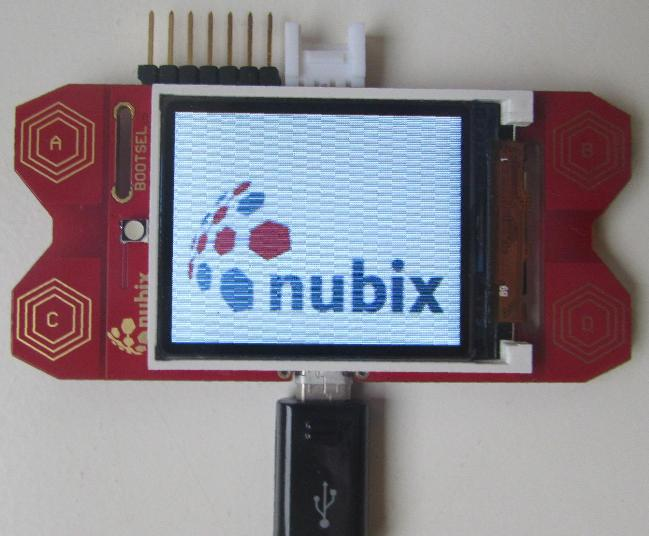

# What is OPNIC?

OPNIC is an artificial project name... It is a low-cost hardware platform designed to show what is possible with a budget of €6 for electronic components. The nubix engineers took on the challenge of developing a universally usable platform with this limited budget. The hardware consists of:
- MCU PR2040 dual core Cortex M0+ @ 125 MHz
- 264 kByte RAM and 512 kByte Flash
- 160 x 128 RGB TFT LCD
- 4 x capacitive touch buttons
- RGB LED
- 3-axis gyroscope, 3-axis accelerometer MPU6050
- connectivity: USB, SWD, UART or I2C, 3 x GPIO /w ADC
- USB powered
  
...which is quite a lot for just 6€. 
The even bigger challenge was to bring a smoothly playable arcade game to this hardware, which we managed to do quite well. It's a great pleasure to see what incredible performance can be achieved with inexpensive electronics if you develop the right software for it. 
We are making the software, libraries and hardware developed for this available to the general public as open source (BSD3 license) and invite you to experiment, expand and use this platform. We are very excited to see what applications you come up with for this platform.

# Quick-start

1. fit a 2¢ euro coin into BOOTSEL to switch into programming mode
2. connect the board via micro USB cable to the computer
3. remove the coin
4. run: `./build.sh -+ snake release uf2`

For more information, read the [development](DEVELOPMENT.md) file.

# Folder structure

Folder structure is the following:

- `doc`: contains the documentation
- `hardware`: contains the EAGLE files
- `firmware`: contains the firmware-related folders, like `micropython` and
  `cpp`

Each folder inside the `micropython` and `cpp` directories contains the so
called "projects". A project can be a library with a test script or a target
application.

Note on project compilation: if you don't have the pico-sdk installed on your
system, it will download from the Internet before compiling.

# How to run the build script

All `build.sh` files need to know which project to compile / run. For example
`./build.sh touch [options]` will tell it to use the `touch` project. For more
information, please use the `-h` option.

**Please note that for OPNIC Board Rev. A, programming with Micropython is
unavailable.**

# Thank you

Thank you Ted Rossin for allowing us to make usage and small changes to your
[TFT Display GUI on Raspberry Pi
Pico](https://sites.google.com/site/tedrossin/home/electronics/raspberry-pi-pico#h.tnj1ljp6rrfh)
project.
